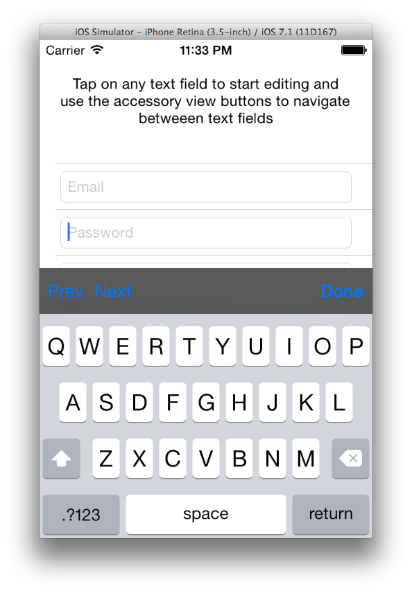
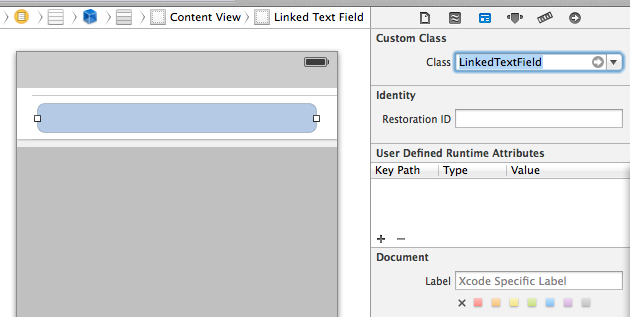
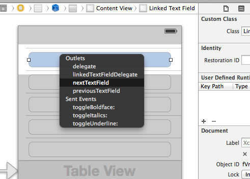

LinkedTextField
===============

LinkedTextField allows connecting to a 'next' a 'previous' text field and provides a keyboard accessory view with next and previous  button used to navigate between connected textfields

How To Use:
===========

- Add LinkedTextField.h and LinkedTextField.m to your project.
- Add UITextField to your xib / storyboard and change it's class to LinkedTextField

- You text field now shows next and previous text field outlets

- Connect these outlets to any other text field which allows navigation between text fields using the keyboard accessory view next and previous buttons

